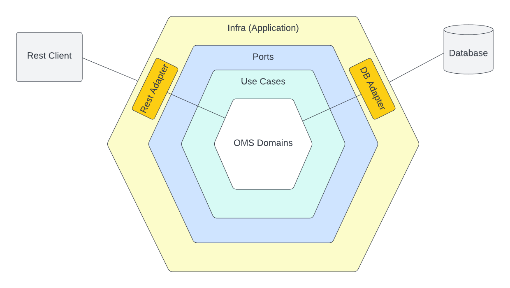

<div id="top"></div>

<!-- PROJECT LOGO -->
<br />
<div align="center">


<h3 align="center">OMS-API</h3>

  <p align="center">
    A simple Order Management System with Hexagonal Architecture
  </p>
</div>

## About The Project

This project has two main package. Domain module contains domain models, ports and use case handlers. Whereas, infra module consist of JPA entites, rest controllers, request handlers etc.

This project adopted Hexagonal Arhictecture in order to do good seperation between domain model and framework, and also make clear communication from outside. The framework is placed at the end of the Hexagon, and the domain is placed at the innermost part of the ring. The domain is not aware which framework is there and how it does things.

Endpoints are integrated with swagger, Apart from this, you can find a Postman collection in the root folder that helps to create some necessary data.



<!-- GETTING STARTED -->
## Getting Started

In order to run the project on your machine, please follow these instructions.

### Prerequisites

Please check your installed Docker engine version around 20.x.x
* Check Docker engine version
  ```sh
  docker version
  ```

### Run with Docker

For convenince, there is a build script that executes below commands. 

1. Pull the image to your machine 
   ```sh 
   docker pull berk2s/oms-api:main
   ```
2. Run the image
   ```sh
   docker run berk2s/oms-api:main
   ```
 
If you build and run project with the Docker image then an embedded database which is H2 will be created also.

### Run with Docker Compose

In order to run more production-like environment, please run with docker compose. 

1. Let up the compose instructions 
   ```sh 
   docker compose up
   ```
When you want to stop application, please run this   
  
2. Stop application
   ```sh
   docker compose down
   ```

With docker-compose, a mysql database server will be created with the application. 

### Run with build.sh

I created a shell script that runs application for your convenience.

Note: This shell script will only run in Linux and MacOS. For windows users, please follow above instructions.

1. Make it executable 
   ```sh 
   chmod +x ./build.sh
   ```  
2. Run it
   ```sh
   ./build.sh
   ```

That's all. Enjoy with the project :)

<p align="right">(<a href="#top">back to top</a>)</p>

[DockerHub repository of the project](https://hub.docker.com/r/berk2s/oms-api)

## Usage

In order to see endpoints, there are two way. One of them with SwaggeUI. Secondly, I added a postman collection json file. 
You can import this file into your postman app. You can find postman collection in the root folder.

For SwaggerUI, please visit 

[Go to SwaggerUI of the project](http://localhost:8080/swagger.html)

or paste to browser http://localhost:8080/swagger.html

